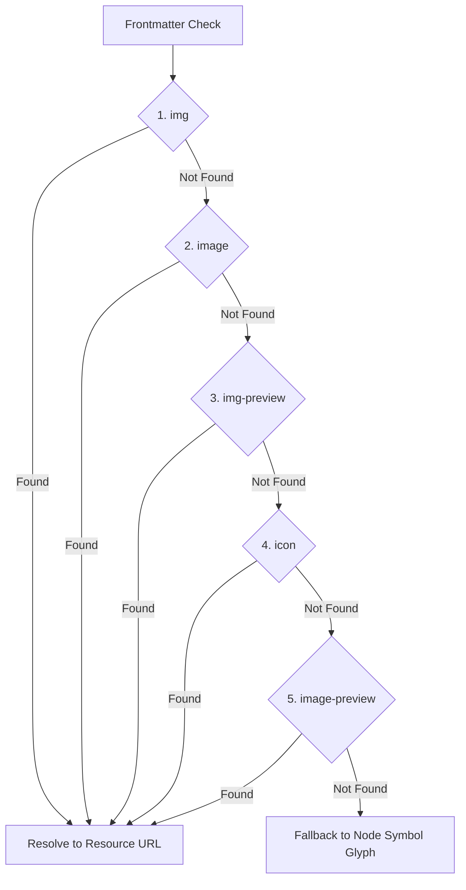

# BubbleGraph: Node Image Cover Feature Brief

## 1. Feature Summary
Allows BubbleGraph nodes to display custom visual covers/thumbnails directly inside the circular bubble node in place of the default link-structure symbol glyphs (`+`, `-`, `i`, `○`, `•`, `▫`, `*`).

When enabled, the plugin inspects each markdown note's YAML frontmatter and extracts an image URL using a strict waterfall priority. If no image property is defined, if the target file cannot be found in the vault, or if the image fails to load, the node automatically falls back to its default symbol glyph.

---

## 2. Waterfall Priority Hierarchy
The frontmatter properties are evaluated in the following order:

1. **`img`**: e.g., `img: "[[attachments/cover.png]]"`
2. **`image`**: e.g., `image: "https://example.com/cover.jpg"`
3. **`img-preview`**: e.g., `img-preview: "covers/book-thumb.webp"`
4. **`icon`**: e.g., `icon: "[[avatars/hero.png]]"`
5. **`image-preview`**: e.g., `image-preview: "assets/preview.png"`

---

## 3. Supported Image Target Formats

| Format Type | Frontmatter Example | Resolution Strategy |
| :--- | :--- | :--- |
| **Obsidian Wikilink** | `img: "[[cover.png]]"` or `[[attachments/cover.png\|Hero]]` | Strips `[[`, `]]`, and alias `\|...`, resolves via `app.metadataCache.getFirstLinkpathDest(path, notePath)` to a `TFile`, then converts to `app.vault.getResourcePath(tFile)`. |
| **Vault Relative Path** | `image: "assets/covers/hero.png"` | Strips leading `./` or `/`, searches via `app.vault.getAbstractFileByPath()`, converts to `app.vault.getResourcePath(tFile)`. |
| **External Web URL** | `img: "https://images.unsplash.com/photo-123"` | Used directly as image source URL (`http://` or `https://`). |
| **Data URL** | `img: "data:image/png;base64,..."` | Loaded directly into canvas image context. |
| **YAML Array** | `img: [ "cover.png" ]` | First entry extracted and resolved. |

---

## 4. Rendering & Performance Architecture

### High-Speed Canvas Draw Loop (60 FPS)
- **Zero Allocations per Frame**: `new Image()` is **never** instantiated inside the draw loop.
- **Asynchronous ImageCache**: Images are cached in a dedicated `Map<string, HTMLImageElement>`.
- **Loading State**: While an image is downloading or decoding in memory, `img.complete && img.naturalWidth > 0` returns `false`. During this interval, the canvas seamlessly renders the fallback node glyph with zero flicker.
- **Circular Clipping & Aspect Ratio (Object-Fit: Cover)**:
  - Context is saved and clipped with `ctx.arc(node.x, node.y, effRadius, 0, Math.PI * 2)`.
  - Image width and height are scaled to preserve original aspect ratio while completely filling the circle without distortion.
- **Accent Rim Stroke**: A crisp border stroke is drawn around the cropped image using the node's cluster/folder color, preserving visual cohesion with the surrounding graph cluster.

---

## 5. UI Controls & Integration
1. **Plugin Settings**: A global toggle `"Enable Node Image Cover"` in the Bubble Graph settings tab.
2. **Header Quick Toggle**: An image icon button (`'image'`) in the header settings bar for instant one-click toggling between image covers and glyph symbols.
3. **Inspector Preview Card**: When a node is selected in the Inspector sidebar, a preview of the note's cover image is displayed alongside its hierarchy metadata and backlinks.
4. **Live Frontmatter Reactivity**: When note frontmatter is edited in Obsidian, `app.metadataCache.on('changed')` automatically updates the node's image in real time without requiring a full graph reload.
