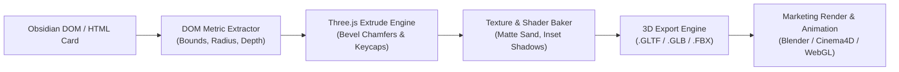

# 📋 Backlog: Automated HTML to 3D (FBX/GLTF) Advertising Pipeline

### 🔴 1. Latar Belakang & Tujuan (Marketing Visual Disruption)
- **Keterbatasan Format 2D**: Seluruh materi promosi plugin Obsidian di pasar saat ini mengandalkan screenshot atau GIF 2D datar yang seragam dan mudah dilewati saat pengguna scroll media sosial (Reddit, X/Twitter).
- **Potensi Estetika Tactile 3D**: Antarmuka bertema *3D Beveled Keycap* milik PakCLI memiliki daya tarik fisik yang kuat seperti perangkat audio analog / mechanical keyboard.
- **Tujuan Utama**: Membangun pipeline otomatisasi yang mengekstraksi struktur HTML/DOM Obsidian dan mengonversinya menjadi model poligon 3D nyata (`.fbx` / `.gltf`) untuk kebutuhan materi iklan, video render sinematik, dan turntable interaktif.

---

### 🟢 2. Arsitektur Teknis & Alur Eksekusi

#### 1. Ekstraksi Metrik DOM (DOM Metric & Hierarchy Scanner)
* Membaca struktur bounding box elemen antarmuka (`getBoundingClientRect()`, `border-radius`, `box-shadow`, dan warna tema).
* Menentukan ketebalan sumbu Z berdasarkan hierarki elemen:
  * Frame / Window Dasar: `z = 0mm`
  * Panel Konten & Note Card: `z = 2mm`
  * Ribbon Action Buttons & Interactive Keycaps: `z = 5mm` (diberi bevel chamfer fisik dengan kemiringan 45°).

#### 2. Generator Poligon 3D (Extrude & Chamfer Engine)
* Menggunakan Three.js `ShapeGeometry` dan `ExtrudeGeometry`.
* Menerapkan parameter beveling:
  * `bevelEnabled: true`
  * `bevelThickness: 0.8`
  * `bevelSize: 0.5`
  * `bevelSegments: 4`
* Menghasilkan mesh tombol 3D halus yang realistis menyerupai tombol keyboard mekanik.

#### 3. Material & Shader Baking
* Tekstur bergaya *Warm Sand / Cream Matte* dengan *subtle specular highlight*.
* Ikon dan teks SVG di-bake sebagai tekstur resolusi tinggi (2K/4K) atau diekstrusi sebagai *raised lettering*.

#### 4. Export Pipeline (.FBX & .GLTF)
* **Web-Ready (.GLTF / .GLB)**: Melalui `GLTFExporter` untuk visualisasi langsung di browser atau modal turntable 3D di dalam Obsidian.
* **Production 3D (.FBX)**: Format standar industri yang siap diimpor langsung ke Blender, Cinema4D, atau After Effects untuk animasi kamera berputar, pencahayaan dramatis, dan efek tombol ditekan.

---

### 🚀 3. Skenario Materi Iklan (Marketing Assets)
1. **Video Promo 15 Detik (The Tactile Workstation)**:
   * Kamera 3D berputar mengelilingi antarmuka Obsidian yang timbul secara fisik.
   * Efek tombol ribbon 3D ditekan ke bawah secara berurutan diiringi suara micro-click audio PakCLI yang memuaskan.
2. **Interactive 3D Turntable di Web Showcase**:
   * Calon pengguna dapat memutar, memperbesar, dan melihat UI PakCLI secara 360 derajat di halaman demo web.
3. **Hero Image Resolusi Tinggi**:
   * Render 3D isometric untuk banner GitHub repository dan thumbnail komunitas Reddit/X.
