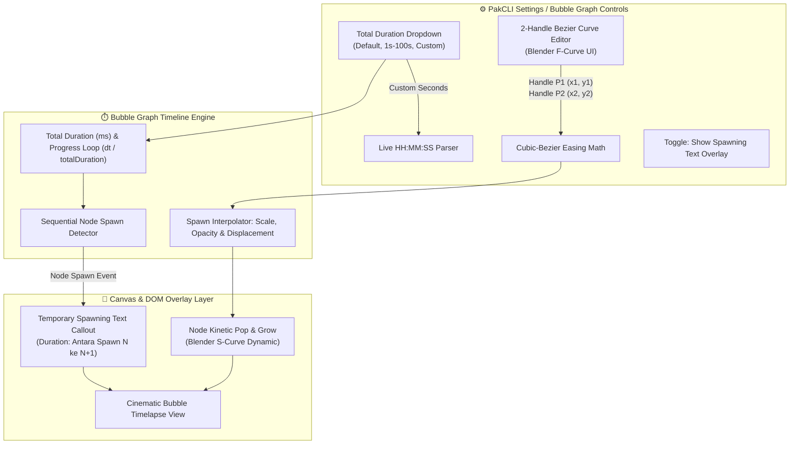

# 📋 Brief Fitur: Bubble Graph Timeline Animation, Blender-Style 2-Handle Curve Editor & Spawning Text Overlay (v04)

### 🔴 1. Latar Belakang & Masalah (The Need for Cinematic Graph Timelapse)

1. **Timelapse Graph Kaku & Kurang Feedback Naratif**:
   - Saat timeline bubble graph dimainkan (*timelapse mode*), node-node baru bermunculan ke kanvas tanpa penanda teks yang jelas. Pengguna tidak bisa langsung mengetahui note apa yang baru saja "lahir" dan posisinya di mana tanpa harus memicingkan mata membaca teks kecil di slider bawah.
2. **Durasi Total Hardcoded & Tidak Fleksibel**:
   - Durasi timelapse saat ini dihitung secara flat (`0.025s` per node untuk mode vanilla atau `12s` statis untuk mode waktu). 
   - Pengguna tidak memiliki kebebasan menentukan durasi spesifik untuk skenario berbeda (misal: *preview cepat 2–5 detik* untuk media sosial, atau *playback presentasi 30–60 detik*, atau *arsip panjang custom*).
3. **Animasi Spawning Tanpa Kontrol Easing Kurva**:
   - Pertumbuhan skala dan opasitas node saat spawn bersifat linier atau statis, tidak memiliki rasa kinetik / elastis.
   - Tidak ada antarmuka kurva (*curve editor*) visual untuk mengatur percepatan dan perlambatan animasi sesuai preferensi kreator visual (seperti *Blender F-Curve / Graph Editor*).

---

### 🟢 2. Arsitektur & Spesifikasi Implementasi

---

### 🧩 3. Rincian Komponen & Alur Teknis

#### 1. Kontrol Durasi Timeline & Live Parser HH:MM:SS
* **Pilihan Dropdown Total Duration**:
  * `Current (Default)`: Menggunakan kalkulasi dinamis bawaan (`nodes.length × 0.025s` atau mode waktu ~12s).
  * `1s`, `2s`, `4s`, `5s`, `8s`, `10s`, `20s`, `30s`, `50s`, `100s`.
  * `Custom`: Memunculkan kotak input angka (*number textbox*).
* **Input Custom & Live Parser**:
  * Input berupa angka detik (misal: `125`, `3600`, `7320`).
  * Di sebelah kanan input terdapat badge live parsing berformat `hh-mm-ss` / `hh:mm:ss`:
    * Contoh: `65s` $\rightarrow$ `00:01:05`
    * Contoh: `3665s` $\rightarrow$ `01:01:05`
* **Logika Perhitungan Per-Frame**:
  $$\Delta \text{Progress} = \frac{\Delta t}{\text{TotalDurationMs}}$$
  Setiap *render loop* (`requestAnimationFrame`), progress bergerak mulus dari `0.0` ke `1.0` tepat sesuai durasi yang dipilih.

---

#### 2. Editor Kurva Animasi 2-Handle (Blender Graph / F-Curve Style)
* **Antarmuka Visual Interaktif**:
  * Komponen kanvas/SVG berlatar belakang gelap (*dark grid*) dengan garis pemandu frame (`0, 5, 10, ... 60`) dan garis tengah referensi (*centerline guides*), persis seperti **Graph Editor Blender** pada gambar referensi.
  * **Titik Awal ($P_0$)**: `(0, 0)` di pojok kiri bawah.
  * **Titik Akhir ($P_3$)**: `(1, 1)` di pojok kanan atas.
  * **Dua Handle Tangent Interaktif**:
    * **Handle 1 ($P_1$)**: Mengontrol akselerasi awal (panjang & sudut tangent kiri).
    * **Handle 2 ($P_2$)**: Mengontrol deselerasi akhir (panjang & sudut tangent kanan).
  * Titik handle dapat di-*drag* langsung dengan mouse / trackpad secara real-time.
* **Matematika Interpolasi Bézier Derajat 3 (Cubic Bézier)**:
  $$B(t) = (1-t)^3 P_0 + 3(1-t)^2 t P_1 + 3(1-t) t^2 P_2 + t^3 P_3 \quad (t \in [0, 1])$$
* **Preset Kurva Cepat (One-Click Presets)**:
  * 🔴 **Blender Smooth (S-Curve)**: Default `cubic-bezier(0.42, 0.0, 0.58, 1.0)`
  * ⚡ **Snappy Anticipation (Fast Ease)**: `cubic-bezier(0.25, 0.1, 0.25, 1.0)`
  * 🎈 **Elastic Pop & Settle**: Handle overshoot melampaui `1.0` untuk efek lentur gelembung air.
  * 📏 **Linear**: `cubic-bezier(0.0, 0.0, 1.0, 1.0)`

---

#### 3. Temporary Spawning Text Overlay ("Text Sementara Appear")
* **Perilaku Kemunculan**:
  * Setiap kali sebuah node baru di-*spawn* ke kanvas graf saat playback timeline berlangsung:
  * Muncul teks *callout / badge* elegan di atas kanvas graf (atau melayang tepat di dekat koordinat node baru tersebut) yang menampilkan judul note / filename node yang baru saja lahir.
* **Durasi Tampilan (Spawn-to-Spawn Lifetime)**:
  * Teks ini **hanya tampil selama interval durasi dari spawn node tersebut sampai spawn node berikutnya**.
  * Saat node $N+1$ di-*spawn*, teks node $N$ otomatis berganti (*cross-fade* mulus) ke teks node $N+1$.
  * Jika timeline mencapai akhir atau dipause, teks tetap stabil atau memudar lembut (*fade out*).
* **Dinamika Animasi Berbasis Kurva 2-Handle**:
  * Skala dan opasitas teks mengikuti kurva Bézier yang disetel di editor:
    * *Start*: Opasitas 0, Scale 0.7, Y-offset +10px
    * *Mid (Ease curve)*: Opasitas 1, Scale 1.05 (overshoot pop)
    * *Settle*: Scale 1.0, Glow aksen tema PakCLI.

---

### 📁 4. Rencana File & Modul yang Dimodifikasi / Ditambahkan

| File Target | Tanggung Jawab / Perubahan |
| :--- | :--- |
| `src/settings.ts` | Menambahkan interface setting: `bubbleTimelapseDurationMode`, `bubbleTimelapseCustomSeconds`, `bubbleSpawnTextEnabled`, `bubbleCurveHandle1`, `bubbleCurveHandle2`. |
| `src/features/bubblegraph/types.ts` | Definisi tipe data `BezierHandles`, `SpawnTextState`, dan `TimelineDurationPreset`. |
| `src/features/bubblegraph/components/BezierCurveEditor.ts` *(Baru)* | Komponen visual editor kurva 2-handle (Blender UI) dengan canvas interaktif, drag handle, dan grid time ticks. |
| `src/features/bubblegraph/bubbleGraphView.ts` | Integrasi dropdown durasi, live parser `hh:mm:ss`, kalkulasi `dt / totalDurationMs`, dan trigger spawn text overlay. |
| `src/features/bubblegraph/canvasRenderer.ts` | Render efek spawning node kinetik menggunakan kalkulasi kurva Bézier dan render text overlay di layer teratas. |
| `src/styles/bubbleGraph.scss` | Styling dark grid F-Curve, handle controls, styling spawning text badge, dan dropdown durasi. |

---

### 🚀 5. Indikator Keberhasilan (Definition of Done)
1. ✅ **Dropdown Total Durasi**: Berfungsi dari `Default` sampai `100s` serta opsi `Custom`.
2. ✅ **Live Parser HH:MM:SS**: Mengubah input detik custom menjadi format jam-menit-detik secara akurat tanpa lag.
3. ✅ **2-Handle Curve Editor (Blender Style)**: Visual grid frame ticks dengan handle $P_1$ dan $P_2$ yang responsif terhadap drag-and-drop.
4. ✅ **Spawning Text Banner**: Teks nama note muncul tepat saat node spawn dan berganti secara presisi saat node berikutnya spawn.
5. ✅ **Kinetik Halus**: Node spawn terasa elastis dan memukau, cocok untuk pembuatan konten dan visualisasi knowledge vault.
