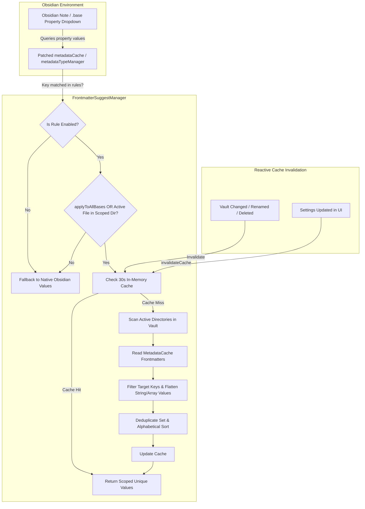

# 🏷️ v11: Frontmatter Property Scoper (Scoped Property Suggestions)

> **Feature Name**: Scoped Property Suggestions & Frontmatter Property Scoper  
> **Status**: Implemented & Operational · **Version**: v11  
> **Target Files**:  
> • [`FrontmatterSuggestManager.ts`](file:///d:/0pro/pakcli-plugin/panel/src/features/frontmatterSuggester/FrontmatterSuggestManager.ts) (Core Engine & Obsidian API Patches)  
> • [`FrontmatterSuggestCardRenderer.ts`](file:///d:/0pro/pakcli-plugin/panel/src/features/frontmatterSuggester/ui/FrontmatterSuggestCardRenderer.ts) (Settings UI & Dual-View Cards)  
> • [`FolderSuggest.ts`](file:///d:/0pro/pakcli-plugin/panel/src/features/frontmatterSuggester/ui/FolderSuggest.ts) (Vault Directory Autocomplete Modal)  
> • [`types.ts`](file:///d:/0pro/pakcli-plugin/panel/src/features/frontmatterSuggester/types.ts) (Data Models & Serializers)  
> • [`main.ts`](file:///d:/0pro/pakcli-plugin/panel/src/main.ts#L3545-L3558) (Lifecycle Registration & Local Settings Section)  

---

## 1. Executive Summary & Problem Statement

### 1.1 The Problem
In standard Obsidian (and Obsidian Base `.base` tables), autocomplete suggestions for YAML frontmatter properties (e.g. `category`, `status`, `tag`, `type`) are **vault-wide and unconstrained**.
- When editing a technical note or a structured database table, typing a category triggers a massive dropdown containing thousands of irrelevant terms collected from recipes, daily journal entries, archived imports, and third-party notes.
- Obsidian provides no native mechanism to say: *"For property `category`, only suggest values that exist within my `Dictionary/` or `Projects/IT/` folders."*
- As a vault grows, property dropdowns suffer from cognitive overload, typo propagation, and autocomplete pollution.

### 1.2 The Solution
**Frontmatter Property Scoper** introduces granular directory-level scoping for Obsidian property dropdowns:
1. **Targeted Frontmatter Keys**: Scope any property name or comma-separated alias list (e.g. `category, categori, kategori`).
2. **Directory Sourcing**: Restrict suggestions strictly to values extracted from markdown notes located inside user-designated vault folders.
3. **Dual Editing Modes**:
   - **Card View**: Visual cards with live folder search (`FolderSuggest`), path validation badges, and single-click `1` (Active) / `0` (Disabled) toggles.
   - **String View**: Raw multiline text area (`path:1` / `path:0`) for instant bulk pasting, configuration backups, and keyboard-first workflows.
4. **Live Discovered Value Inspector**: Real-time interactive chips rendered directly in the settings UI, allowing instant verification of discovered values without needing to open a note.
5. **Zero-Latency In-Memory Caching**: Cached lookups with automatic event-driven invalidation on vault file changes, renames, and deletions.

---

## 2. Architecture & How It Works Under the Hood



### 2.1 Monkey-Patching Obsidian Native Autocomplete APIs
Obsidian's internal autocomplete for frontmatter properties relies on three primary methods. `FrontmatterSuggestManager` intercepts and decorates all three cleanly:
1. `app.metadataCache.getFrontmatterPropertyValuesForKey(key: string)`: Intercepts core metadata suggestions.
2. `app.metadataTypeManager.getPropertyValues(key: string)`: Intercepts Property Types manager lookups.
3. `app.metadataTypeManager.getAssignedValues(key: string)`: Intercepts assigned values in property popovers and table headers.

When the plugin is disabled or unloaded, `destroy()` restores the original references seamlessly with zero side-effects on the vault.

### 2.2 Scope Filtering Logic (`applyToAllBases`)
Each rule provides an `applyToAllBases` toggle:
- **`applyToAllBases: true` (Global Scoping)**: Any note or `.base` file in the entire vault will receive the scoped suggestions for that property key.
- **`applyToAllBases: false` (Contextual Scoping)**: Scoped suggestions only activate if the note currently being edited (or the active `.base` leaf) resides physically inside one of the rule's active directories. If edited elsewhere, it falls back to native Obsidian behavior.

### 2.3 Value Extraction & Normalization
- Supports scalar values (`category: DevOps`).
- Supports YAML arrays (`category: [DevOps, Cloud, Kubernetes]`).
- Trims whitespace, ignores empty strings or `null`/`undefined`.
- Deduplicates via `Set<string>` and sorts case-insensitively using `localeCompare()`.

---

## 3. Settings UI Specification (`FrontmatterSuggestCardRenderer`)

```text
┌────────────────────────────────────────────────────────────────────────┐
│ Scoped Property Suggestions (v11)                                      │
│ Scope Obsidian Base and note property dropdowns to specific folders.  │
│                                                                        │
│ [X] Enable Scoped Property Suggestions          [ + Add Property Rule ] │
├────────────────────────────────────────────────────────────────────────┤
│ ┌─ RULE CARD ────────────────────────────────────────────────────────┐ │
│ │ 🏷️ Frontmatter Column: [ category, categori      ]                 │ │
│ │    [x] ⚡ All Bases in Vault   [x] Active   [ 📝 String View ] [🗑️] │ │
│ │ ────────────────────────────────────────────────────────────────── │ │
│ │ 📁 Scoped Directory Sources (Vault Folders):    [ + Add Directory ]│ │
│ │                                                                    │ │
│ │  📁 [ Dictionary                    ] [✔ Valid]  [🟢 1 (Active)] [x]│ │
│ │  📁 [ IT/Networking                 ] [✔ Valid]  [🟢 1 (Active)] [x]│ │
│ │  📁 [ Archive/Legacy-2023           ] [✔ Valid]  [⚪ 0 (Disabled)][x]│ │
│ │                                                                    │ │
│ │ ╌╌╌╌╌╌╌╌╌╌╌╌╌╌╌╌╌╌╌╌╌╌╌╌╌╌╌╌╌╌╌╌╌╌╌╌╌╌╌╌╌╌╌╌╌╌╌╌╌╌╌╌╌╌╌╌╌╌╌╌╌╌╌╌ │ │
│ │ Live Discovered Values: 14 found                                   │ │
│ │ [Automation] [CI/CD] [Database] [Frontend] [Security] [Testing]    │ │
│ └────────────────────────────────────────────────────────────────────┘ │
└────────────────────────────────────────────────────────────────────────┘
```

### 3.1 Card View vs String View
| Feature | Card View (`🎴`) | String View (`📝`) |
|---|---|---|
| **Intended Use** | Visual inspection, folder picking, interactive toggling | Bulk imports, keyboard navigation, copy/paste backups |
| **Folder Input** | `FolderSuggest` popover with fuzzy vault directory search | Multi-line raw textarea (`path:1` or `path:0`) |
| **Validation** | Real-time `✔ Valid` or `⛔ Not Found in Vault` chip badges | Live error box highlighting unrecognized folder paths |
| **Activation** | Visual button toggling between `🟢 1 (Active)` and `⚪ 0 (Disabled)` | Plain numeric flag suffix (`:1` vs `:0`) |
| **Serialization** | Stored internally as `FrontmatterSuggestDirectory[]` | Formatted via `serializeDirectoryRules` / `deserializeDirectoryRules` |

### 3.2 Live Value Inspector Chips
Directly beneath the folder list, the card renders a live preview of distinct frontmatter values discovered in real time:
- Automatically scans all markdown files matching active folders.
- Displays up to 30 chip tags with an overflow count (`+N more`).
- Shows `(No matching frontmatter values found in active directories yet)` if folders are empty or unassigned.
- Proves immediately to the user that the configuration is working before they return to writing notes.

---

## 4. Data Models & Schemas

```ts
export interface FrontmatterSuggestDirectory {
  path: string;                // Vault directory path (e.g., "Dictionary" or "IT/Networking")
  active: boolean;             // true = 1 (Active), false = 0 (Disabled)
  includeSubfolders?: boolean; // default true: recursively include subfolders
}

export interface FrontmatterSuggestRule {
  id: string;                  // Unique timestamp/UUID (e.g., "rule_1740000000000")
  propertyKey: string;         // Single key or comma-delimited aliases (e.g., "category, categori")
  enabled: boolean;            // Master switch for this individual rule
  applyToAllBases: boolean;    // true = global across all notes/.base; false = contextual
  directories: FrontmatterSuggestDirectory[];
  viewMode?: 'card' | 'string';
}

export interface FrontmatterSuggesterSettings {
  enableFrontmatterSuggester: boolean;
  frontmatterSuggestRules: FrontmatterSuggestRule[];
}
```

### Serialized String View Format:
```text
Dictionary:1
IT/Networking:1
Resources/Templates:0
```
- Lines beginning with `= ` are automatically sanitized.
- Empty lines and lines without colons are filtered out safely.

---

## 5. Edge Cases & Resilience

1. **Missing or Deleted Vault Folders**:
   - `isFolderValid(dir.path)` verifies physical existence via `app.vault.getAbstractFileByPath()`.
   - Invalid paths highlight with red background and an explicit `⛔ Not Found in Vault` warning, without crashing the scanner.
2. **Vault Root Scoping**:
   - Setting path to `""` or `"/"` represents the entire vault root safely.
3. **Property Key Aliases & Case-Sensitivity**:
   - `propertyKey` handles comma-separated entries with arbitrary spaces: `"category, categori , Kategori"`.
   - Key matching is case-insensitive.
4. **Performance on Large Vaults (10,000+ Notes)**:
   - Uses `app.metadataCache.getFileCache()`, which is an in-memory indexed cache inside Obsidian — zero disk reads are performed.
   - Cache results are held for 30 seconds (`cacheByRuleId`) and invalidated reactively only on vault mutation events.
5. **Obsidian Hot Module Reload (HMR) & Unload**:
   - Event listeners and patched prototypes are cleanly dereferenced in `destroy()`.

---

## 6. Verification & Quality Checklist

- [x] Master toggle completely turns off monkey-patches when disabled.
- [x] Autocomplete popovers in Reading/Live Preview and `.base` tables strictly display scoped values.
- [x] Multiple directories merge values without duplicates.
- [x] Inactive directories (`:0`) are excluded from discovered values.
- [x] Folder picker (`FolderSuggest`) accurately suggests subfolders.
- [x] String View parses and serializes multiline text bidirectionally without data loss.
- [x] TypeScript compiles with 0 errors (`npx tsc --noEmit`).
